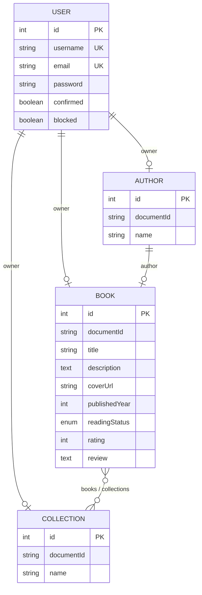

# SupBook — Documentation technique et guide utilisateur

**SupBook** est une application web de gestion de bibliothèque personnelle. Elle permet à chaque utilisateur de gérer ses livres, de suivre leur statut de lecture et de les organiser en collections.

Le projet est composé de deux parties :

| Dossier | Rôle |
|---------|------|
| `supbook-backend/` | API REST (Strapi 5) |
| `supbook-frontend/` | Interface utilisateur (React + Vite) |

---

## Table des matières

1. [Schéma relationnel Strapi](#1-schéma-relationnel-strapi)
2. [Procédure d'installation backend](#2-procédure-dinstallation-backend)
3. [Procédure d'installation frontend](#3-procédure-dinstallation-frontend)
4. [Variables d'environnement (.env)](#4-variables-denvironnement-env)
5. [Choix techniques](#5-choix-techniques)
6. [Guide utilisateur](#6-guide-utilisateur)

---

## 1. Schéma relationnel Strapi

### 1.1 Vue d'ensemble

L'application repose sur **4 entités métier** (3 content-types custom + le plugin Users & Permissions de Strapi) et leurs relations.

```
┌─────────────────┐
│      User       │  (plugin users-permissions)
│  up_users       │
└────────┬────────┘
         │
    ┌────┴────┬──────────────┐
    │         │              │
    ▼         ▼              ▼
┌───────┐ ┌────────┐  ┌────────────┐
│ Book  │ │ Author │  │ Collection │
└───┬───┘ └────┬───┘  └─────┬──────┘
    │          │            │
    └──────────┴────────────┘
         (relations croisées)
```

### 1.2 Diagramme entité-relation



### 1.3 Détail des content-types

#### User — `plugin::users-permissions.user`

Entité fournie par le plugin **Users & Permissions** (table `up_users`). Gère l'authentification et les comptes utilisateurs.

| Champ | Type | Contraintes |
|-------|------|-------------|
| `username` | string | Requis, unique, min. 3 caractères |
| `email` | email | Requis, unique, min. 6 caractères |
| `password` | password | Requis, min. 6 caractères (hashé) |
| `confirmed` | boolean | Compte confirmé |
| `blocked` | boolean | Compte bloqué |
| `role` | relation | Rôle (`Authenticated`, `Public`, etc.) |

---

#### Book — `api::book.book` (table `books`)

| Champ | Type | Contraintes | Description |
|-------|------|-------------|-------------|
| `title` | string | **Requis** | Titre du livre |
| `description` | text | — | Résumé ou synopsis |
| `coverUrl` | string | — | URL de l'image de couverture |
| `publishedYear` | integer | — | Année de publication |
| `readingStatus` | enumeration | `toRead`, `reading`, `finished` | Statut de lecture |
| `rating` | integer | — | Note de 1 à 5 |
| `review` | text | — | Avis personnel |
| `owner` | relation oneToOne | → User | Propriétaire du livre |
| `author` | relation oneToOne | → Author | Auteur du livre |
| `collections` | relation manyToMany | ← Collection | Collections contenant ce livre |

**Options :** Draft & Publish activé (`publishedAt` requis pour publication).

---

#### Author — `api::author.author` (table `authors`)

| Champ | Type | Contraintes | Description |
|-------|------|-------------|-------------|
| `name` | string | **Requis** | Nom de l'auteur |
| `owner` | relation oneToOne | → User | Propriétaire de la fiche auteur |

**Options :** Draft & Publish activé.

---

#### Collection — `api::collection.collection` (table `collections`)

| Champ | Type | Contraintes | Description |
|-------|------|-------------|-------------|
| `name` | string | **Requis** | Nom de la collection |
| `owner` | relation oneToOne | → User | Propriétaire de la collection |
| `books` | relation manyToMany | → Book | Livres regroupés dans la collection |

**Options :** Draft & Publish activé.

---

### 1.4 Tableau des relations

| Relation | Type | Déclarée sur | Cible | Description |
|----------|------|--------------|-------|-------------|
| User → Book | oneToOne | `Book.owner` | User | Chaque livre est rattaché à un utilisateur |
| User → Author | oneToOne | `Author.owner` | User | Chaque auteur est rattaché à un utilisateur |
| User → Collection | oneToOne | `Collection.owner` | User | Chaque collection est rattachée à un utilisateur |
| Author → Book | oneToOne | `Book.author` | Author | Un livre a un auteur |
| Book ↔ Collection | manyToMany | `Collection.books` / `Book.collections` | Book ↔ Collection | Un livre peut appartenir à plusieurs collections |

### 1.5 Endpoints API REST

Base URL : `http://localhost:1337/api`

| Ressource | GET (liste) | GET (détail) | POST | PUT | DELETE |
|-----------|-------------|--------------|------|-----|--------|
| Livres | `/books` | `/books/:documentId` | `/books` | `/books/:documentId` | `/books/:documentId` |
| Auteurs | `/authors` | `/authors/:documentId` | `/authors` | `/authors/:documentId` | `/authors/:documentId` |
| Collections | `/collections` | `/collections/:documentId` | `/collections` | `/collections/:documentId` | `/collections/:documentId` |

**Authentification utilisateur :**

| Méthode | Endpoint | Corps |
|---------|----------|-------|
| `POST` | `/auth/local/register` | `{ username, email, password }` |
| `POST` | `/auth/local` | `{ identifier, password }` → retourne `{ jwt, user }` |

Les requêtes protégées nécessitent le header : `Authorization: Bearer <JWT>`.

---

## 2. Procédure d'installation backend

### 2.1 Prérequis

- **Node.js** : version 20 à 24 (`>= 20.0.0 <= 24.x.x`)
- **npm** : version 6 ou supérieure

### 2.2 Installation pas à pas

**Étape 1 — Accéder au dossier backend**

```bash
cd supbook-backend
```

**Étape 2 — Configurer les variables d'environnement**

```bash
cp .env.example .env
```

Ouvrir le fichier `.env` et remplacer toutes les valeurs `tobemodified` / `toBeModified` par des clés aléatoires sécurisées (voir section 4).

**Étape 3 — Installer les dépendances**

```bash
npm install
```

**Étape 4 — Démarrer Strapi en mode développement**

```bash
npm run develop
```

Le serveur démarre sur **http://localhost:1337**.

**Étape 5 — Créer le compte administrateur**

1. Ouvrir **http://localhost:1337/admin** dans un navigateur.
2. Remplir le formulaire de création du premier compte admin Strapi.

**Étape 6 — Configurer les permissions API**

Pour que le frontend fonctionne, activer les droits CRUD pour les utilisateurs authentifiés :

1. Aller dans **Settings → Users & Permissions → Roles**.
2. Cliquer sur le rôle **Authenticated**.
3. Cocher les permissions **find**, **findOne**, **create**, **update**, **delete** pour :
   - `Book`
   - `Author`
   - `Collection`
4. Sauvegarder.

### 2.3 Commandes utiles

| Commande | Description |
|----------|-------------|
| `npm run develop` | Mode développement (rechargement automatique) |
| `npm run build` | Compilation du panel admin |
| `npm run start` | Mode production (après `build`) |
| `npm run console` | Console interactive Strapi |

### 2.4 Base de données

Par défaut, le projet utilise **SQLite** (fichier `.tmp/data.db`). Aucune installation de serveur de base de données n'est nécessaire en développement.

---

## 3. Procédure d'installation frontend

### 3.1 Prérequis

- **Node.js** compatible avec React 19 et Vite 8
- Le **backend Strapi** démarré et accessible (voir section 2)

### 3.2 Installation pas à pas

**Étape 1 — Accéder au dossier frontend**

```bash
cd supbook-frontend
```

**Étape 2 — Configurer les variables d'environnement**

Créer un fichier `.env` à la racine du dossier frontend :

```env
VITE_API_URL=http://localhost:1337
```

Adapter l'URL si le backend tourne sur un autre hôte ou port.

**Étape 3 — Installer les dépendances**

```bash
npm install
```

**Étape 4 — Lancer le serveur de développement**

```bash
npm run dev
```

L'application est accessible sur **http://localhost:5173** (port par défaut de Vite).

### 3.3 Commandes utiles

| Commande | Description |
|----------|-------------|
| `npm run dev` | Serveur de développement avec HMR |
| `npm run build` | Build de production (dossier `dist/`) |
| `npm run preview` | Prévisualisation du build de production |
| `npm run lint` | Analyse ESLint du code |

### 3.4 Ordre de démarrage recommandé

1. Démarrer le **backend** (`supbook-backend` → `npm run develop`)
2. Démarrer le **frontend** (`supbook-frontend` → `npm run dev`)
3. Ouvrir **http://localhost:5173** dans le navigateur

---

## 4. Variables d'environnement (.env)

### 4.1 Backend — `supbook-backend/.env`

Copier depuis `.env.example` puis personnaliser.

#### Serveur

| Variable | Exemple | Description |
|----------|---------|-------------|
| `HOST` | `0.0.0.0` | Adresse d'écoute du serveur |
| `PORT` | `1337` | Port HTTP de l'API Strapi |

#### Sécurité (obligatoires — générer des valeurs uniques)

| Variable | Description |
|----------|-------------|
| `APP_KEYS` | Clés de chiffrement des sessions (plusieurs clés séparées par des virgules) |
| `API_TOKEN_SALT` | Salt pour les tokens API admin |
| `ADMIN_JWT_SECRET` | Secret JWT du panel d'administration |
| `TRANSFER_TOKEN_SALT` | Salt pour les transfer tokens |
| `JWT_SECRET` | Secret JWT du plugin Users & Permissions |
| `ENCRYPTION_KEY` | Clé de chiffrement des données admin |

> **Important :** ne jamais committer le fichier `.env` contenant de vraies clés. Utiliser `.env.example` comme modèle.

#### Base de données

| Variable | Défaut | Description |
|----------|--------|-------------|
| `DATABASE_CLIENT` | `sqlite` | Client DB : `sqlite`, `mysql` ou `postgres` |
| `DATABASE_FILENAME` | `.tmp/data.db` | Chemin du fichier SQLite |
| `DATABASE_HOST` | — | Hôte MySQL/PostgreSQL |
| `DATABASE_PORT` | — | Port MySQL (`3306`) ou PostgreSQL (`5432`) |
| `DATABASE_NAME` | — | Nom de la base |
| `DATABASE_USERNAME` | — | Utilisateur de la base |
| `DATABASE_PASSWORD` | — | Mot de passe de la base |
| `DATABASE_SSL` | `false` | Activation du SSL |

**Exemple minimal (SQLite, développement) :**

```env
HOST=0.0.0.0
PORT=1337
APP_KEYS="cle1,cle2,cle3,cle4"
API_TOKEN_SALT=ma_cle_api_salt
ADMIN_JWT_SECRET=mon_secret_admin_jwt
TRANSFER_TOKEN_SALT=mon_transfer_salt
JWT_SECRET=mon_secret_jwt
ENCRYPTION_KEY=ma_cle_chiffrement
DATABASE_CLIENT=sqlite
DATABASE_FILENAME=.tmp/data.db
```

---

### 4.2 Frontend — `supbook-frontend/.env`

| Variable | Exemple | Description |
|----------|---------|-------------|
| `VITE_API_URL` | `http://localhost:1337` | URL de base du backend Strapi |

> Seules les variables préfixées par `VITE_` sont exposées au code client par Vite.

**Exemple :**

```env
VITE_API_URL=http://localhost:1337
```

Pour la production, adapter l'URL vers le serveur Strapi déployé avant de lancer `npm run build`.

---

## 5. Choix techniques

### 5.1 Architecture globale

SupBook suit une architecture **client-serveur** classique :

- Le **frontend** (SPA React) gère l'interface utilisateur et communique avec l'API via HTTP.
- Le **backend** (Strapi) expose une API REST, gère la persistance des données et l'authentification JWT.

```
┌──────────────┐       HTTP/REST        ┌──────────────┐
│   Frontend   │  ◄──────────────────►  │   Backend    │
│  React/Vite  │   Authorization:       │   Strapi 5   │
│  port 5173   │   Bearer <JWT>         │   port 1337  │
└──────────────┘                        └──────┬───────┘
                                               │
                                        ┌──────▼───────┐
                                        │   SQLite     │
                                        │  .tmp/data.db│
                                        └──────────────┘
```

### 5.2 Backend

| Technologie | Version | Justification |
|-------------|---------|---------------|
| **Strapi** | 5.48.0 | Headless CMS mature, génération automatique d'API REST, authentification intégrée, panel admin |
| **TypeScript** | 5.x | Typage fort pour la configuration Strapi |
| **SQLite** | via `better-sqlite3` | Base légère, sans installation serveur, idéale pour le développement |
| **Users & Permissions** | plugin Strapi | Authentification JWT, gestion des rôles et permissions granulaires |
| **Draft & Publish** | activé | Permet de contrôler la publication des contenus via l'admin |

**Modèle de données :** 3 content-types custom (`Book`, `Author`, `Collection`) avec relations explicites vers l'utilisateur propriétaire, permettant une isolation logique des données par compte.

### 5.3 Frontend

| Technologie | Version | Justification |
|-------------|---------|---------------|
| **React** | 19.2.6 | Bibliothèque UI réactive, composants réutilisables |
| **Vite** | 8.0.12 | Bundler rapide, HMR instantané, configuration minimale |
| **React Router** | 7.17.0 | Routing SPA, routes protégées par authentification |
| **Axios** | 1.17.0 | Client HTTP avec gestion simple des headers et des erreurs |
| **CSS custom** | — | Thème sombre moderne avec variables CSS, sans dépendance à un framework CSS |

**Organisation du code :**

```
src/
├── api/           # Couche d'accès aux données (auth, books, authors, collections)
├── context/       # État global d'authentification (AuthContext)
├── pages/         # Pages principales (Login, Register, Library, Collections)
├── components/    # Composants réutilisables (BookCard, AddBookModal, CollectionCard)
├── App.jsx        # Router et routes protégées
└── index.css      # Styles globaux
```

### 5.4 Authentification

- **Inscription / Connexion** via l'API Strapi (`/api/auth/local/register` et `/api/auth/local`).
- Le **JWT** et les informations utilisateur sont stockés dans le **localStorage** du navigateur.
- Chaque requête API authentifiée envoie le header `Authorization: Bearer <token>`.
- Les routes `/library` et `/collections` sont **protégées** : redirection vers `/login` si aucun token n'est présent.

### 5.5 Décisions de conception

| Décision | Raison |
|----------|--------|
| Pas de state manager externe (Redux, Zustand) | L'état est simple (auth global + state local par page) |
| Pas de TypeScript côté frontend | Prototypage rapide, projet pédagogique en JavaScript |
| Compatibilité Strapi v4/v5 dans le code | Gestion de `attributes.title` et `title`, `documentId` et `id` |
| CSS custom sans framework | Contrôle total du design, thème sombre cohérent |
| SQLite en développement | Zéro configuration, démarrage immédiat |

---

## 6. Guide utilisateur

### 6.1 Accéder à l'application

1. Ouvrir l'URL du frontend (ex. **http://localhost:5173**).
2. L'application redirige automatiquement vers la page de **connexion**.

---

### 6.2 Créer un compte

1. Sur la page de connexion, cliquer sur **« S'inscrire »**.
2. Remplir les champs :
   - **Nom d'utilisateur** (obligatoire)
   - **Email** (obligatoire)
   - **Mot de passe** (obligatoire)
3. Cliquer sur **« S'inscrire »**.
4. En cas de succès, l'utilisateur est connecté automatiquement et redirigé vers sa **bibliothèque**.

---

### 6.3 Se connecter

1. Saisir son **email** et son **mot de passe**.
2. Cliquer sur **« Se connecter »**.
3. En cas de succès, redirection vers la **bibliothèque**.
4. En cas d'erreur, un message s'affiche : « Email ou mot de passe incorrect ».

> Si l'utilisateur est déjà connecté, accéder à `/login` le redirige directement vers la bibliothèque.

---

### 6.4 Gérer sa bibliothèque

La page **Bibliothèque** (`/library`) est l'écran principal de l'application.

#### En-tête

- Titre **« SupBook 📚 »**
- Salutation personnalisée : **« Bonjour, {nom d'utilisateur} »**
- Lien **« mes collections »** pour accéder aux collections
- Bouton **« Se déconnecter »**

#### Rechercher et filtrer

- **Barre de recherche** : filtre les livres par titre (recherche instantanée).
- **Filtre par statut** :
  - **Tous** — affiche tous les livres
  - **À lire** — livres non commencés
  - **En cours** — livres en cours de lecture
  - **Terminé** — livres lus

#### Ajouter un livre

1. Cliquer sur **« + Ajouter un livre »**.
2. Remplir le formulaire dans la modale :

   | Champ | Obligatoire | Description |
   |-------|:-----------:|-------------|
   | Titre | Oui | Nom du livre |
   | Description | Non | Résumé ou synopsis |
   | URL de la couverture | Non | Lien vers une image |
   | Année de publication | Non | Année (nombre) |
   | Statut de lecture | Oui | À lire / En cours / Terminé |
   | Note | Non | De 1 à 5 étoiles |
   | Votre avis | Non | Commentaire personnel |
   | Auteur | Non | Sélectionner un auteur existant ou en créer un |

3. Pour **créer un nouvel auteur** : cliquer sur « + Nouvel auteur », saisir le nom, puis valider.
4. Cliquer sur **« Ajouter »** pour enregistrer le livre.
5. Cliquer sur **« Annuler »** ou en dehors de la modale pour fermer sans sauvegarder.

#### Consulter un livre

Chaque livre s'affiche sous forme de **carte** avec :
- La couverture (ou un placeholder 📚)
- Le titre et le nom de l'auteur
- Un badge de statut de lecture (couleur selon le statut)
- La note en étoiles (si renseignée)
- La description (tronquée)

#### Supprimer un livre

1. Cliquer sur **« Supprimer »** sur la carte du livre.
2. Le livre est immédiatement retiré de la bibliothèque.

> La suppression d'un livre ne le retire pas automatiquement des collections associées côté backend. Retirer un livre d'une collection ne supprime pas le livre de la bibliothèque.

#### Bibliothèque vide

Si aucun livre n'est enregistré, un message **« Votre bibliothèque est vide »** s'affiche avec un bouton pour ajouter le premier livre.

---

### 6.5 Gérer ses collections

Accéder aux collections via le lien **« mes collections »** dans l'en-tête de la bibliothèque.

#### Créer une collection

1. Saisir un **nom** dans le champ « Nom de la collection ».
2. Cliquer sur **« Créer une collection »**.
3. La collection apparaît dans la grille.

#### Ajouter un livre à une collection

1. Sélectionner une **collection** dans la liste déroulante.
2. Sélectionner un **livre** de la bibliothèque.
3. Cliquer sur **« Ajouter à la collection »**.

#### Consulter une collection

Chaque collection s'affiche sous forme de carte avec :
- Le **nom** de la collection
- La **liste des livres** qu'elle contient
- Un message « Aucun livre dans cette collection » si elle est vide

#### Retirer un livre d'une collection

- Cliquer sur **✕** à côté du titre du livre dans la collection.
- Le livre est retiré de la collection mais **reste dans la bibliothèque**.

#### Supprimer une collection

- Cliquer sur **« Supprimer »** sur la carte de la collection.
- La collection est définitivement supprimée. Les livres qu'elle contenait ne sont **pas** supprimés.

#### Retour à la bibliothèque

Cliquer sur **« ← Bibliothèque »** en haut de la page collections.

---

### 6.6 Se déconnecter

1. Cliquer sur **« Se déconnecter »** dans l'en-tête de la bibliothèque.
2. La session est effacée (token supprimé du navigateur).
3. Toute tentative d'accès à une page protégée redirige vers la connexion.

---

### 6.7 Récapitulatif des parcours

```
Accès application
       │
       ▼
  Token présent ?
   /          \
 Non          Oui
  │            │
  ▼            ▼
Login      Bibliothèque
  │            │
  ├─ Register  ├─ Rechercher / Filtrer
  │            ├─ Ajouter un livre
  └─ Login ──► ├─ Supprimer un livre
               ├─ Collections
               │     ├─ Créer
               │     ├─ Ajouter un livre
               │     ├─ Retirer un livre
               │     └─ Supprimer
               └─ Se déconnecter
```
